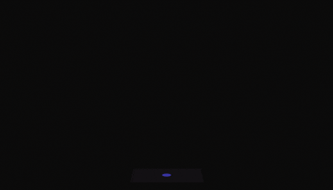
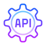
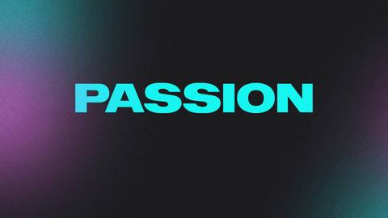

## 

   
<pre align="center">console.log("Hello, World !");</pre>

  <b><i> Moi c'est Leïla / Aliiel ! 👋 </b></i> 
  ⚡ <i>Développeuse Web FullStack</i> ⚡  
  ✨ Bienvenue sur mon profil Github ! 

  
<i>À propos de moi 👇</i>

  
 
    Issue d’un parcours de reconversion, je développe avec <b>passion</b> des projets aussi bien côté backend que <b>frontend</b>, avec une préférence pour le back et la <b>sécurité applicative</b>. 
    <b>Perfectionniste</b> et <b>créative</b>, j'aime que mon code et mes interfaces soient non seulement <b>fonctionnels</b>, mais aussi <b>élégants</b>, pour offrir la <b>meilleure expérience utilisateur</b>. 
    Animée par une vraie <b>curiosité</b>, je cherche à <b>comprendre</b> en profondeur le fonctionnement des choses et à explorer toujours plus loin pour trouver la <b>solution</b> la plus <b>pertinente</b>. 
    J’accorde une grande importance au <b>sens du détail</b> et au <b>professionnalisme</b>, et ma <b>capacité d'adaptation</b> me permet de m'intégrer rapidement dans de nouveaux environnements et de relever efficacement des <b>défis techniques</b>. 
    Enfin, ma <b>persévérance</b> et ma <b>résilience</b> sont mes meilleurs alliées lorsque les choses ne fonctionnent pas du premier coup 😄 
  

  

    
  

## ⚙️ Technologies

<table align="center" border="2" width="1000">
  <tr>
    <th width="50%" style="text-align:center">
      
             
      <b>BACKEND</b>
    </th>
    <th width="50%" style="text-align:center">
      
       
      <b>FRONTEND</b>
    </th>
  </tr>
  <tr>
    <td style="text-align:center">
      <i>Langages :</i>  
       
    </td>
    <td style="text-align:center">
      <i>Langages :</i>  
       
    </td>
  </tr>
  <tr>
    <td style="text-align:center">
      <i>Frameworks :</i>  
       
    </td>
    <td style="text-align:center">
      <i>Frameworks :</i>  
       
    </td>
  </tr>
  <tr>
    <td style="text-align:center">
      <i>Bases de données :</i>  
       
    </td>
    <td style="text-align:center">
      <i>Bibliothèques :</i>  
       
    </td>
  </tr>
</table>

## 🔥 Compétences pratiques

<table width="100%" align="center">
  <tr>
    <td>
      <ul>
        <li>Développement d'<b>API REST sécurisées</b> avec <b>JWT</b> et <b>gestion des rôles</b>
          
          

            
            
          

        </li>
         
        <li>Écriture de <b>tests unitaires et d’intégration d'API</b> : Postman, JUnit, Mockito
          
          

            
            
            
          

        </li>
         
        <li>Conteneurisation de projets avec <b>Docker</b>
          
          

            
          

        </li>
         
        <li>Documentation et test d’API avec <b>Swagger</b>
          
          

            
          

        </li>
         
        <li>
          

            
💜
  
              

                
              

          

        </li>
      </ul>
    </td>
  </tr>
</table>

## 🖥️ Workflow de développement

<table width="100%">
  <tr>
    <th>IDE utilisés</th>
    <th>Versioning & Collaboration</th>
    <th>Gestion de projet & UX/UI</th>
    <th>Méthodologies de travail</th>
  </tr>
  <tr>
    <td> VS Code, IntelliJ, WebStorm, Eclipse  
    
    </td>
    <td> Git, GitHub, Bitbucket  
    
    </td>
    <td> Figma, Trello, Jira  
    
    
    
    </td>
    <td> Agile, Scrum, Kanban  
    
    
    
    </td>
  </tr>
</table>

## 🛠️ Projets

  

---

### 🌐 Portfolio

📖 **Description :** Portfolio personnel  
⏳ En cours de développement  
💡 A venir 🡆 Développement d'une **API REST** avec tableau de bord permettant :  
🡒 la gestion des **formulaires** de contact reçus 
🡒 la gestion des **projets personnels** visibles depuis mon portfolio 

⚙️ **Tech utilisées (actuellement) :**  

🔗 [Code](https://github.com/Aliiel/portfolio-leila)

---

### 🛒 Cire & Sérénité

📖 **Description :** Mini application **e-commerce** pour bougies, cires et encens 
⏳ Frontend en cours de développement 
🗄️ Partie backend réalisée avec :  
🡒 authentification **JWT** (inscription et connexion) 
🡒 gestion centralisée des **exceptions**

⚙️ **Tech utilisées :**  

🔗 [Code](https://github.com/Aliiel/ecommerce-app)

---

### 🐾 CoupDePatte

📖 **Description :** Application de Signalement d’Animaux Perdus ou Trouvés uniquement sur la partie **backend** 
🔒 Projet collaboratif | rôle 🡆 partie **sécurité et authentification** :  
🡒 authentification **JWT** 
🡒 protection des routes selon les **rôles** 
🡒 gestion centralisée des **exceptions** 

⚙️ **Tech utilisées :**  

🔗 [Code](https://github.com/Aliiel/CoupDePatte)

---

### 💼 NextLine

📖 **Description :** Application destinée à dématérialiser la fiche de renseignement entreprise pour la rédaction de conventions de stage  
📊 Projet collaboratif | rôle 🡆 partie "entreprises" :  
🡒 Envoi d’un mail avec lien unique sécurisé par **JWT** pour accéder au formulaire 
🡒 Formulaire pré-rempli automatiquement à partir du numéro SIRET via l’**API Siren**

⚙️ **Tech utilisées :**  

🔗 Code : [Backend](https://github.com/Noneku/API-nextLine) | [Frontend](https://github.com/Aliiel/NextLine)

## 📬 Contacts

  Vous pouvez me contacter via mon profil linkedin ou directement par mail ici ⤵️

  
  

---

 

  

